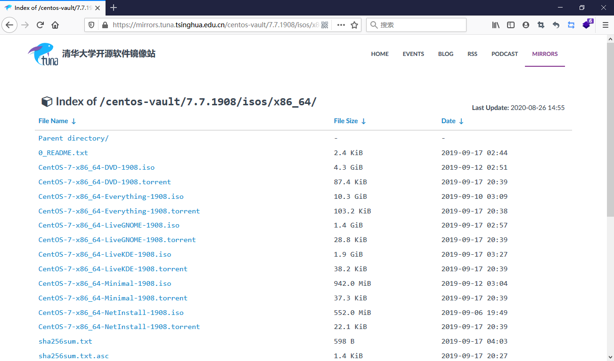
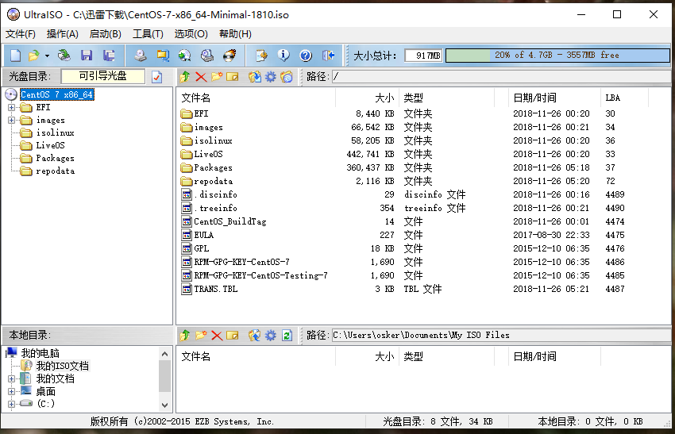
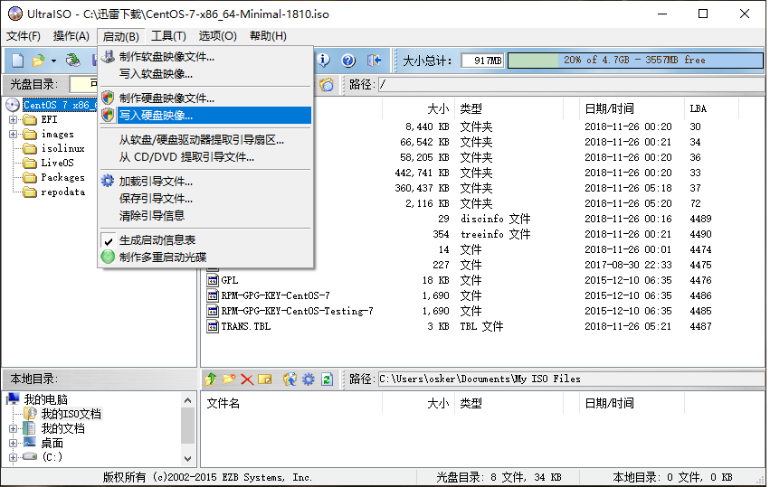
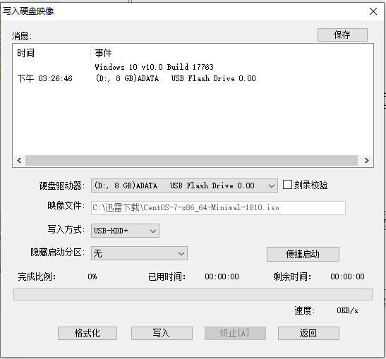
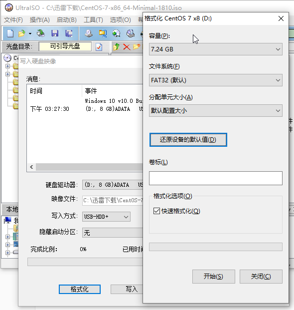
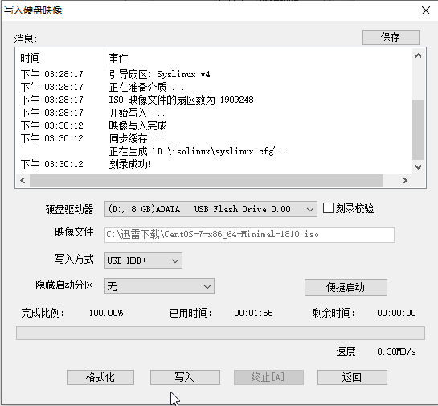
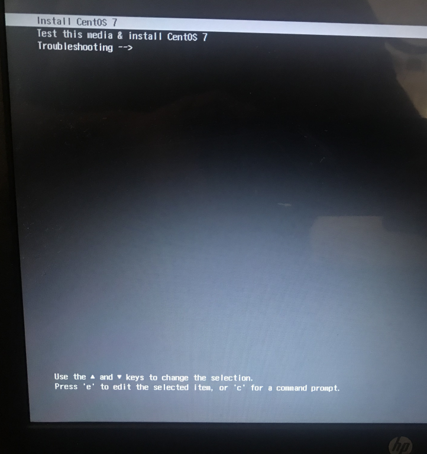
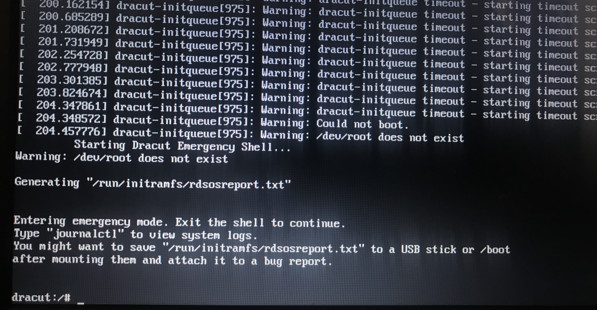
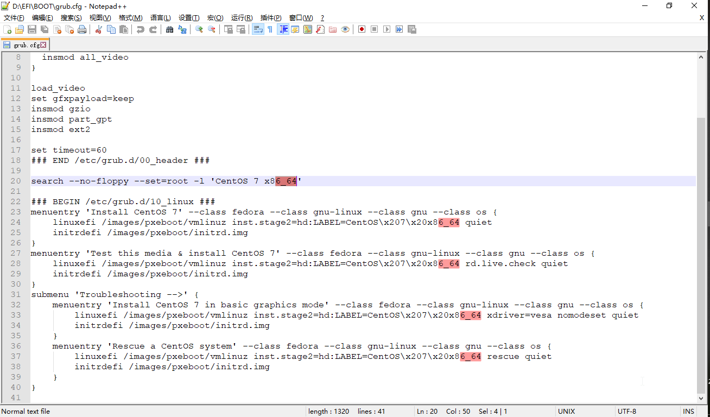
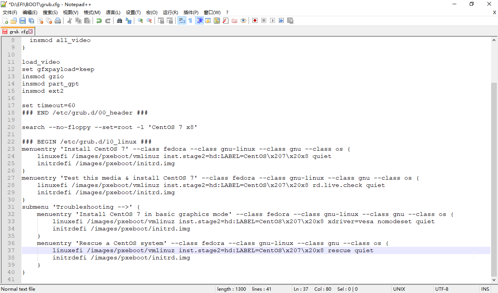

# 使用u盘在pc上安装centos7(安装停留在dracut:/#)

## 1.下载iso镜像文件

### 1.1到阿里云或者清华源下载对应的iso系统镜像

此处我们选择centos7.7 64位 minimal版本 及CentOS-7-x86_64-Minimal-1908,使用迅雷下载下来.
下载链接:https://mirrors.tuna.tsinghua.edu.cn/centos-vault/7.7.1908/isos/x86_64/CentOS-7-x86_64-Minimal-1908.iso

对于如何选择历史的各个版本
我们进入https://mirrors.aliyun.com/centos-vault/ 或者 https://mirrors.tuna.tsinghua.edu.cn/centos-vault/ 选择对应的版本例如6.9,点击进入,选择isos,选择x86_64,找到对应的版本,可以选择torrent种子下载和直接下载,下载后建议进行md5sum值验证(md5sum.txt).

## 2.将iso镜像刻录到u盘

### 2.1 下载软碟通

本次是用 UltraISO 软碟通(下载地址:https://cn.ezbsystems.com/dl2.php?file=uiso9_cn.exe)将iso系统镜像刻录到u盘.(警告:u盘请做好备份,刻录时候会格式化u盘)

使用软碟通打开iso镜像

### 2.2 写入镜像到u盘

点击启动,选择写入硬盘镜像

## 3.使用u盘安装系统

### 3.1 将u盘插入电脑,开机设置BIOS为u盘启动

略

### 3.2 进入u盘引导后,选择install centos7

### 3.3 启动失败

一系列的加载后,最后停在这里:

### 3.4 修改u盘文件

关机,拔掉u盘,插会电脑,查看到u盘名称为:CentOS 7 x8

打开u盘,进入EFI\BOOT,编辑grub.cfg

将下图标红的几个地方删除后,保存.

修改后

### 3.5 重新使用u盘启动,就ok了.